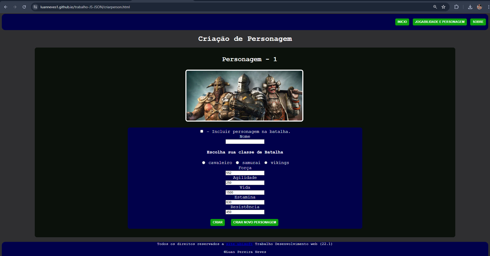

# Meu Primeiro Site

Este projeto é o primeiro site que desenvolvi durante o primeiro semestre na faculdade de Análise e Desenvolvimento de Sistemas na Universidade Estácio. O site foi criado para praticar habilidades iniciais em desenvolvimento web, incluindo HTML, CSS e JavaScript.

## Captura de Tela



Descrição: Esta é a interface do meu primeiro site. Ele apresenta uma estrutura básica de páginas web e incorpora elementos de design simples para proporcionar uma experiência de usuário agradável.

## Descrição do Projeto

Este projeto foi desenvolvido como parte das atividades acadêmicas no curso de Análise e Desenvolvimento de Sistemas. O objetivo era criar um site do zero, aplicando os conhecimentos adquiridos nas aulas iniciais sobre desenvolvimento web.

## Tecnologias Utilizadas

- **HTML**: Linguagem de marcação utilizada para estruturar o conteúdo do site.
- **CSS**: Linguagem de estilo utilizada para estilizar o site, proporcionando um layout e design agradáveis.
- **JavaScript**: Linguagem de programação utilizada para adicionar interatividade ao site.

## Como Usar

1. Clone o repositório para a sua máquina local:
    ```bash
    git clone https://github.com/usuario/meu-primeiro-site.git
    cd meu-primeiro-site
    ```

2. Abra o arquivo `index.html` no seu navegador para visualizar o site.

## Estrutura do Projeto

- `index.html`: Página principal do site.
- `style.css`: Arquivo CSS contendo os estilos do site.
- `script.js`: Arquivo JavaScript contendo a lógica para interatividade.
- `img/`: Pasta contendo as imagens usadas no site, incluindo a captura de tela.

## Contribuição

Contribuições são bem-vindas! Sinta-se à vontade para enviar pull requests com melhorias ou sugestões.

## Licença

Este projeto está licenciado sob a MIT License. Consulte o arquivo `LICENSE` para mais informações.

---

Desenvolvido durante o primeiro semestre na faculdade de Análise e Desenvolvimento de Sistemas na Universidade Estácio.
